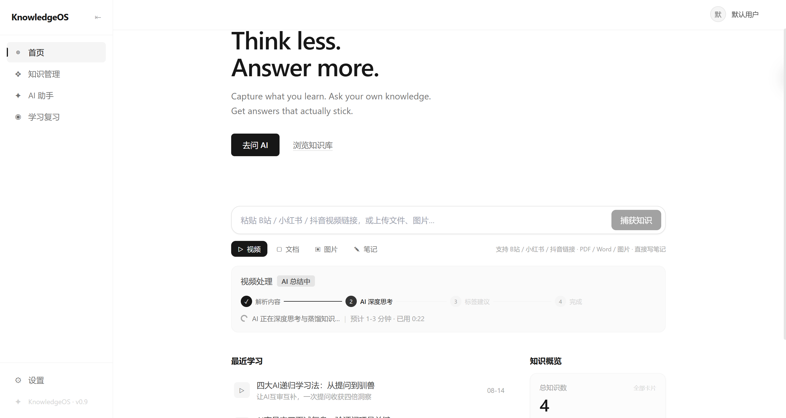
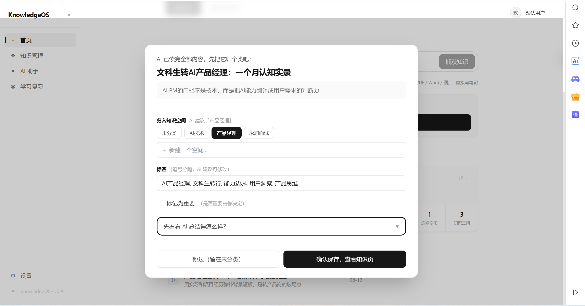
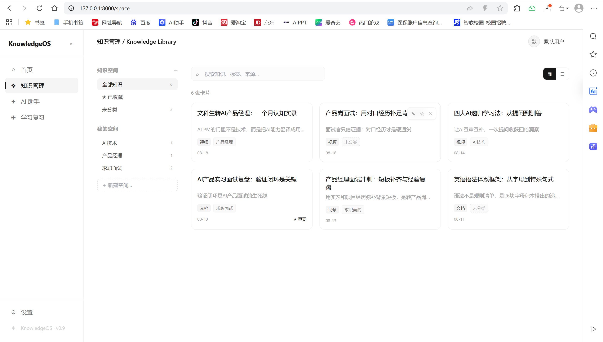
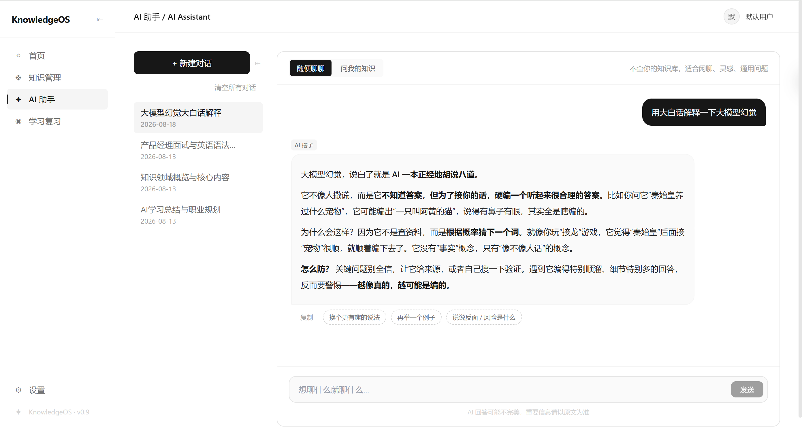
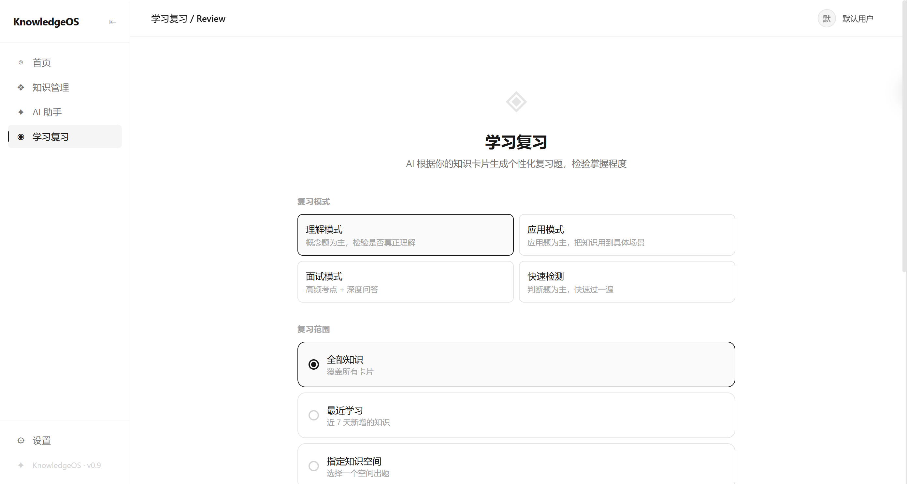
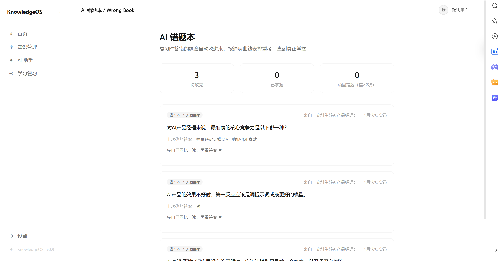

<p align="center">
  
</p>

<h1 align="center">KnowledgeOS</h1>

<p align="center">
  <b>AI 个人知识操作系统</b> — Build your second brain.
  <br/>
  Turn scattered information into structured knowledge.
</p>

<p align="center">
  
  
  
  
  
  
  
</p>

---

## 一、产品定位

**KnowledgeOS 是一个 AI 个人知识操作系统**，目标是把个人从「信息过载」中解放出来，帮助用户完成 **输入 → 理解 → 沉淀 → 复习 → 应用** 的完整闭环，最终形成属于自己的 **AI 第二大脑**。

一句话概括：**它不只是一个「AI 总结工具」，而是一个完整覆盖知识全生命周期的个人操作系统** —— 把散落在各个平台、各种格式的信息，自动加工成你的结构化知识库，还能让你以问答、复习等方式反复内化和使用。

产品设计文档见 [`docs/PRD.md`](./docs/PRD.md)，AI 各 Agent 的完整系统提示词见 [`prompts/`](./prompts/)。

---

## 二、它解决了什么问题

大家在日常学习和工作中最头疼的几个问题，KnowledgeOS 给出了一体化的解决方案：

| 常见痛点 | 现状 | KnowledgeOS 的解法 |
|---|---|---|
| **信息碎片化** | B 站、小红书、PDF、网页……内容散落各处，看完就忘 | 多模态统一接入，任意链接/文件一键收录到同一个人知识库 |
| **AI 总结停留在摘要层** | 通用 AI 只给「目录式要点」，读完没感觉，留不下 | **多智能体深度蒸馏**，输出可记忆、可复用、讲清「是什么/为什么/怎么用/常见坑」的知识卡片 |
| **内容没有复用机制** | 收藏夹永远是收藏夹，知识无法被检索和组合 | 知识库支持检索、关联、组合使用，沉淀即资产 |
| **通用 AI 不懂你的知识资产** | 问 ChatGPT 它不知道你已经学过什么 | 基于个人知识库的 **RAG 问答**，回答引用你的来源、建立在你自己的体系之上 |
| **学完就忘** | 不是记不住，而是缺少科学的复习机制 | **多模式智能复习 + 错题本**，用主动回忆对抗遗忘 |

---

## 三、目标用户与使用场景

- **求职 / 备考人群**：刷题笔记、网课内容一键沉淀，配合「面试模式」复习和错题本，形成自己的题库与知识地图。
- **产品 / 工程师等职场人**：把碎片文章、会议、技术视频整理进分类知识库，随时回顾复用到实际项目。
- **终身学习者**：把「收藏夹」变成真正的「第二大脑」，用知识连接、科学复习等方式高效内化大量新领域知识。

---

## 四、核心功能（产品视角）

### 4.1 多模态输入（Capture）—— 什么都能收

支持来自多个渠道、多种形态的内容，统一解析后进入知识沉淀流程：

- **视频**：B 站 / 小红书 / 抖音 视频链接（优先抓取字幕，其次语音转写）
- **文档**：PDF、Word
- **图片**：OCR 识别文字
- **网页**：链接正文提取
- **纯文本**：直接粘贴

处理链路：

```
输入内容 → 内容解析 → AI 知识蒸馏 → 生成知识卡片 → 用户确认保存
```

<p align="center">
  
</p>

### 4.2 AI 深度知识蒸馏（Card 2.0）—— 不是摘要，是理解

这是 KnowledgeOS 与「普通 AI 总结」最核心的差异。它不是输出一段目录式要点，而是由多智能体协同，把一篇内容蒸馏成一张**结构化知识卡**，讲清「是什么 / 为什么重要 / 怎么用 / 常见坑」：

| 卡片要素 | 说明 | 对用户的价值 |
|---|---|---|
| **one_liner** | 一句话点破核心洞察 | 一眼抓住最核心的那个观点 |
| **core_points** | 核心知识 + 机制解释 | 回答「这句话哪来的底气」 |
| **knowledge_structure** | 知识结构树 | 看清知识点之间的关系与脉络 |
| **key_cases** | 实践应用场景 | 知道学了能用在哪儿、怎么用 |
| **next_steps** | 下一步学习建议 | 停止收藏，直接给出行动方向 |

蒸馏过程还会自动输出**常见误区** 与 **快速自测题**，帮助用户真正理解而非表面浏览。

### 4.3 个人知识库（Knowledge Library）—— 你的第二大脑

- **不搞 AI 强制分类**：采用用户自定义「知识空间」（如「AI 产品经理」「Python」「求职」），AI 只给标签建议，归档与分类由你决定，完全可控。
- 每张卡片支持**编辑、删除、收藏、改标签**，灵活维护。

<p align="center">
  
</p>

### 4.4 AI Copilot —— 基于你自己的知识库对话

不是通用聊天，而是**基于你的个人知识库**的 RAG 问答，回答自动附带**来源引用**，可溯源、可验证。三种模式：

- **知识问答**：基于个人知识库回答，引用来源卡片
- **知识连接**：发现不同知识卡片之间的关联、对比与互补
- **学习辅助**：针对你的知识生成学习路线、面试题与实践任务

<p align="center">
  
</p>

### 4.5 智能复习 + 错题本（Review & Wrong Book）—— 对抗遗忘

- **出题范围自选**：最近学习 / 指定知识空间 / 薄弱知识
- **四种模式**：理解模式、应用模式、面试模式、快速检测
- **自动评分**：AI 评分并讲解，**错题自动进错题本**，支持针对性再练

<p align="center">
  
</p>

<p align="center">
  
</p>

### 4.6 首页成长看板（Dashboard）

一屏总览你的知识资产与学习进展：

- 知识卡片总数、知识空间数量
- 复习次数、答题正确率
- 近 14 天学习活跃趋势

<p align="center">
  
</p>

---

## 五、技术架构

采用**前后端分离**架构：

- **后端 FastAPI**：内容解析、向量检索与 **Multi-Agent** 调度
- **前端 React**：黑白极简、类 Notion / Linear 的高级留白风格界面

### 5.1 Multi-Agent 协同调度

不是单一大模型硬扛，而是由五个分工明确的 Agent 协同，并由 Orchestrator 以**状态机**统一编排（`pending → parsing → 去重 → summarizing → classifying → done`）：

| Agent | 职责 |
|---|---|
| **Summarizer** | 把内容蒸馏为 Card 2.0 深度知识卡片 |
| **Structuring** | 一段内容拆分为多个独立概念卡 |
| **Organizer** | 标签与知识空间建议（只建议、不强制） |
| **QA** | 三模式 RAG 问答 |
| **Orchestrator** | 解析 → 去重 → 蒸馏 → 分类的流程编排 |

三条关键设计原则：

1. **轻任务走小模型**：标签分类等用 DeepSeek V3 的 `chat_json`，显著控制成本与延迟
2. **重任务走深度推理**：知识蒸馏、问答经 `smart_json` 路由到 DeepSeek R1 深度思考，再由 V3 转为结构化 JSON，兼顾质量与稳定性
3. **AI 不替用户做决定**：分类、归档、重要性判断最终由用户拍板

### 5.2 检索增强生成（RAG）

采用**双通道召回**解决中文场景向量相似度偏低的问题，大幅提升召回率：

- **向量通道**：sentence-transformers + faiss，语义检索
- **关键词通道**：英文 token + 卡片关键词 / 标签 + CJK 二元组重叠，兜底召回

### 5.3 可靠性设计

- **去重检测**：embedding 命中已有卡片即标记重复，等待用户决策，省去重复的大模型蒸馏成本
- **幂等护栏**：已完成 / 处理中的内容不会重复执行
- **失败兜底**：解析失败自动进入 `failed` 状态并记录原因，重启后自动恢复中断任务

### 5.4 技术栈

| 分层 | 技术 |
|---|---|
| 前端 | React 18 + Vite + TailwindCSS |
| 后端 | FastAPI + SQLAlchemy + SQLite |
| 检索 | sentence-transformers + faiss |
| 大模型 | DeepSeek API（V3 / R1） |
| 内容解析 | yt-dlp（视频）、python-docx、easyocr（图片） |

---

## 六、快速开始

环境要求：Python 3.13+、Node.js 18+、DeepSeek API Key（[platform.deepseek.com](https://platform.deepseek.com) 申请）。

### 启动后端

```bash
cd backend
python -m venv .venv
# Windows: .\.venv\Scripts\activate   macOS/Linux: source .venv/bin/activate

pip install -r requirements.txt

# 可选：视频解析 / OCR / 语音合成 / 向量检索
pip install -r requirements-extras.txt

cp .env.example .env   # 编辑 .env，填入 DEEPSEEK_API_KEY

uvicorn app.main:app --host 0.0.0.0 --port 8000
```

> 首次启动会加载 embedding 模型，约需 1-2 分钟。

### 启动前端

```bash
cd frontend
npm install
npm run dev
```

打开 http://localhost:5173 。前后端通过 Vite 代理通信（`/api` → `http://localhost:8000`），无需额外配置 CORS。

### 运行测试

```bash
cd backend
python -m venv .venv
.\.venv\Scripts\activate   # Windows

pip install -r requirements.txt -r requirements-dev.txt
python -m pytest
```

---

## 七、项目结构

```
knowledgeos/
├── docs/
│   └── PRD.md                    # 产品需求文档
├── prompts/
│   └── README.md                 # 各 Agent 系统提示词索引
├── screenshots/                  # 界面截图
├── backend/
│   ├── app/
│   │   ├── agents/               # Multi-Agent 实现
│   │   ├── api/                  # REST 接口（卡片/问答/复习/统计等）
│   │   ├── services/             # 向量库 / DeepSeek / 内容解析
│   │   ├── models/               # SQLAlchemy 数据模型
│   │   ├── core/                 # 配置
│   │   └── main.py               # FastAPI 入口（单端口托管前后端）
│   ├── tests/                    # 自动化测试（pytest）
│   ├── .env.example
│   ├── requirements.txt          # 核心依赖
│   ├── requirements-extras.txt   # 可选增强依赖（视频/OCR/语音/向量检索）
│   └── requirements-dev.txt      # 测试依赖
└── frontend/
    └── src/
        ├── pages/                # 页面组件（首页/知识库/问答/复习/错题本等）
        ├── components/
        ├── api/                  # 前端接口封装
        ├── App.jsx
        └── main.jsx
```

---

## 八、项目亮点总结

- **不只是工具，而是一个知识操作系统**：完整覆盖「输入 → 理解 → 沉淀 → 复习 → 应用」闭环
- **多模态统一接入**：视频 / 文档 / 图片 / 网页 / 文本，一个入口全收
- **AI 深度蒸馏**：多智能体输出结构化知识卡，拒绝目录式总结
- **Personal RAG**：问答基于你自己的知识库，引用来源、可溯源
- **科学复习 + 错题本**：用主动回忆对抗遗忘
- **成本可控**：轻重任务分流到不同模型，兼顾质量与性价比
- **可信可控**：AI 只做建议，分类与判断始终由用户决定

## 说明

`.env`、数据库文件、上传目录、日志等本地运行产物均已通过 `.gitignore` 排除，仓库中不含任何密钥与个人数据。

## License

MIT